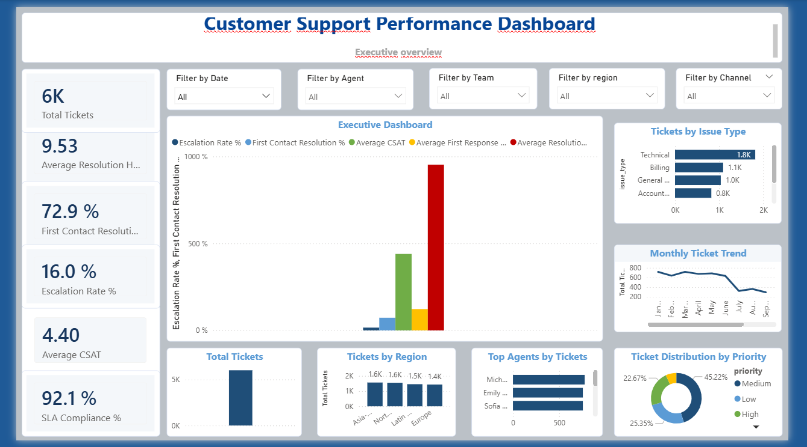
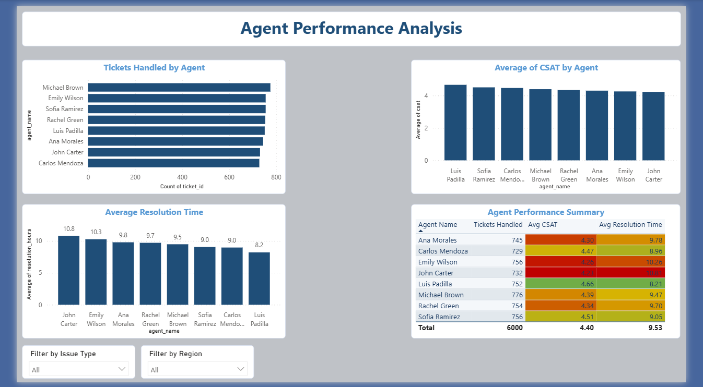
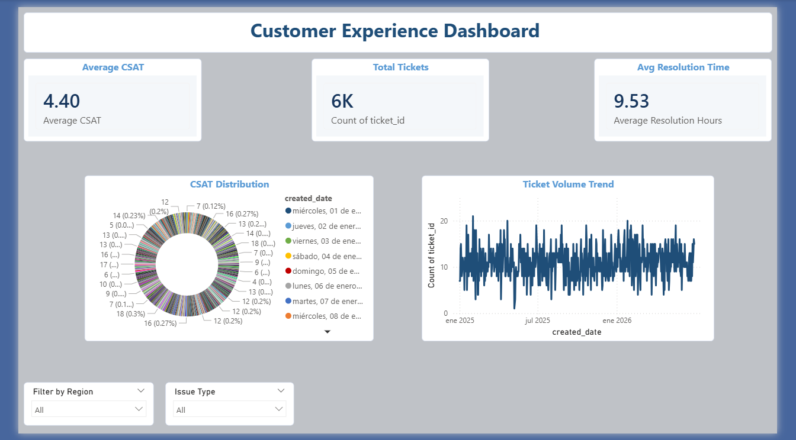
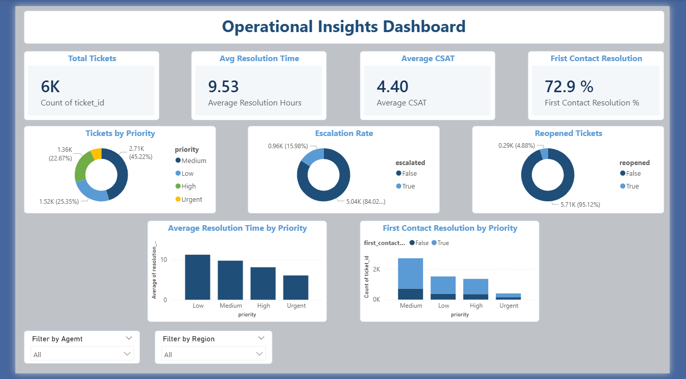

# Customer Support Performance Dashboard

## 📌 Project Overview

This Power BI dashboard was developed to analyze customer support operations and provide decision-makers with clear, interactive insights into service performance. The report consolidates key operational metrics into a single dashboard, allowing managers to monitor trends, evaluate team performance, and identify opportunities to improve customer satisfaction and operational efficiency.

---

## 🎯 Business Problem

Customer support teams often manage thousands of support tickets each month. Without a centralized reporting solution, it is difficult to answer important business questions such as:

- How many tickets are being handled?
- Which agents perform the best?
- Are customers satisfied with the service?
- How long does it take to resolve issues?
- How often are tickets escalated or reopened?

This dashboard addresses those challenges by providing an interactive reporting solution built in Power BI.

---

## 🎯 Project Objectives

- Monitor customer support performance through interactive dashboards.
- Track key performance indicators (KPIs).
- Compare agent productivity.
- Analyze customer satisfaction trends.
- Evaluate operational efficiency.
- Support data-driven decision making.

---

## 🛠 Tools & Technologies

- Microsoft Power BI
- Microsoft Excel
- DAX
- Data Modeling
- Data Visualization

---

## 📊 Dashboard Pages

### Executive Overview
- Total Tickets
- Average CSAT
- Average Resolution Hours
- First Contact Resolution Rate

### Agent Performance
- Tickets Handled by Agent
- Average CSAT by Agent
- Resolution Hours by Agent
- Agent Performance Summary

### Customer Experience
- Customer Satisfaction Trends
- Issue Type Distribution
- Ticket Volume Trends
- Customer Experience Summary

### Operational Insights
- Tickets by Priority
- Escalated Tickets
- Reopened Tickets
- First Contact Resolution Analysis

---

## 💼 Key Skills Demonstrated

- Dashboard Design
- KPI Development
- Data Visualization
- Business Intelligence
- Data Analysis
- DAX Measures
- Power BI Reporting

---

## 📈 Business Insights

This dashboard enables managers to:

- Monitor support performance in real time.
- Identify top-performing agents.
- Detect recurring customer issues.
- Improve customer satisfaction.
- Reduce resolution times.
- Monitor escalation and reopening trends.

---

## 👤 Author

Luis Padilla

Data Analyst Portfolio Project

---

# Dashboard Preview

## Executive Overview

---

## Agent Performance

---

## Customer Experience

---

## Operational Insights

